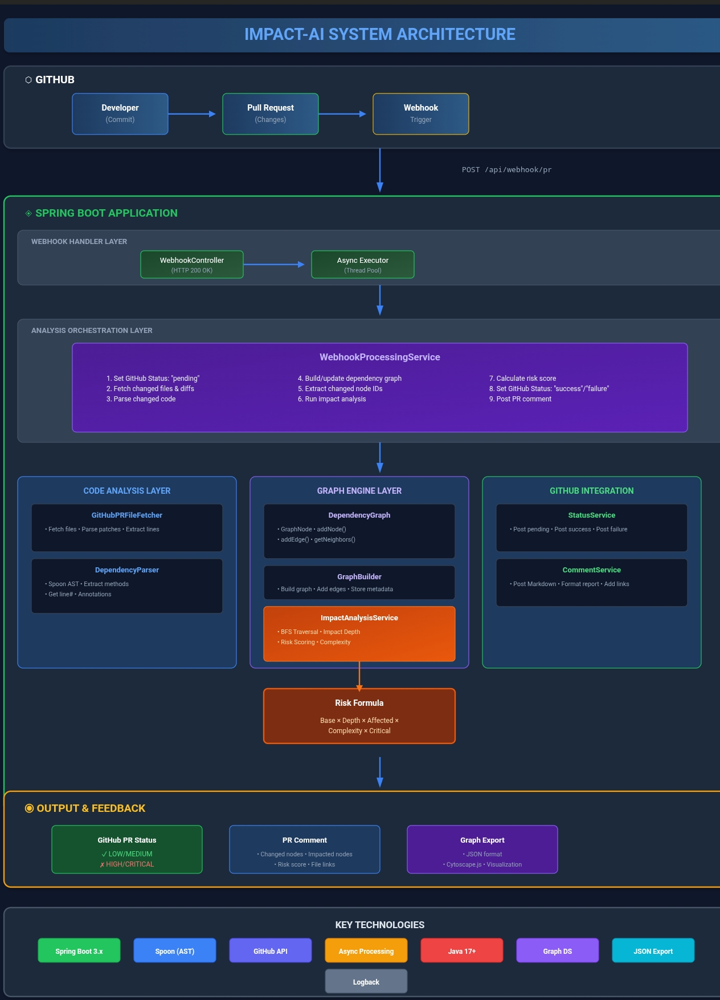
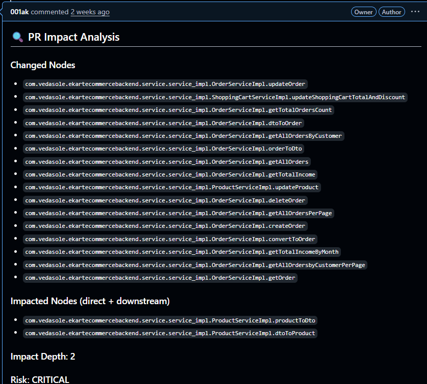

# 🚀 Impact-AI: Intelligent PR Code Impact Analysis & Risk Assessment

**Impact-AI** is an automated, AI-powered code impact analysis and risk assessment system for GitHub Pull Requests. It uses static code analysis, dependency graph traversal, and intelligent risk scoring to help teams understand the blast radius of code changes, enforce merge policies, and prevent risky code from reaching production.

---

## 📋 Table of Contents

- [Overview](#overview)
- [Key Features](#key-features)
- [Architecture](#architecture)
- [Technology Stack](#technology-stack)
- [How It Works](#how-it-works)
- [Installation & Setup](#installation--setup)
- [Configuration](#configuration)
- [Usage](#usage)
- [Example Output](#example-output)
- [AI-Powered Enhancements (Future)](#ai-powered-enhancements-future)
- [Project Structure](#project-structure)
- [Contributing](#contributing)

---

## 🎯 Overview

**The Problem:**  
Modern software development teams face a critical challenge: understanding the true impact of code changes before merging. A seemingly small change can have cascading effects across the codebase, leading to bugs, performance degradation, or system failures in production.

**The Solution:**  
Impact-AI automatically analyzes every Pull Request to:
- **Identify exactly which methods/classes were changed** (line-level precision)
- **Trace the impact through the entire codebase** using dependency graph analysis
- **Calculate a risk score** based on complexity, annotations, impact depth, and change type
- **Enforce merge policies** via GitHub Status Checks (block HIGH/CRITICAL risk PRs)
- **Provide actionable feedback** to developers and reviewers

This system acts as an **automated code guardian**, ensuring that only safe, well-understood changes reach your main branch.

---

## ✨ Key Features

### 🔍 **Line-Level Change Detection**
- Parses unified diffs to extract exact line ranges changed
- Maps changes to specific Java methods (not just files)
- Eliminates false positives from unrelated code in the same file

### 📊 **Intelligent Dependency Graph**
- Constructs a complete call/dependency graph of your codebase
- Tracks method-to-method calls, class dependencies, and injection relationships
- Stores method complexity, annotations, and metadata for each node

### 🎯 **Transitive Impact Analysis**
- Traverses the graph to find all directly and indirectly impacted methods/classes
- Calculates impact depth (how many hops downstream the change propagates)
- Identifies critical bottleneck methods that affect many downstream components

### ⚠️ **Sophisticated Risk Scoring**
Computes risk based on:
- **Change Type**: Logic changes vs. comments/documentation
- **Method Complexity**: Number of method calls and cyclomatic complexity
- **Critical Annotations**: `@Transactional`, `@CacheEvict`, `@Scheduled`, security annotations
- **Impact Breadth & Depth**: Number of impacted nodes and propagation distance
- **Special Cases**: Comment-only changes automatically get LOW risk

**Risk Levels**: `LOW` | `MEDIUM` | `HIGH` | `CRITICAL`

### 🔒 **GitHub Merge Policy Enforcement**
- Posts commit statuses (`pending` → `success`/`failure`) for each PR
- Integrates with GitHub Branch Protection Rules
- Blocks merging of HIGH/CRITICAL risk PRs until reviewed
- Provides visual feedback in the GitHub UI (green check ✅ or red X ❌)

### 💬 **Rich PR Comments**
- Auto-generates detailed Markdown reports on each PR
- Lists changed methods, impacted methods, and risk analysis
- Includes clickable links to exact file/line locations on GitHub
- Explains the reasoning behind the risk score

### 📈 **Graph Visualization**
- Exports dependency graph as JSON for visualization in Cytoscape.js, Gephi, or similar tools
- Enables teams to explore codebase structure and identify architectural issues

---

## 🏗️ Architecture

### High-Level Architecture

-----------------------------

### Component Breakdown

#### 1️⃣ **Webhook Handler**
- Receives GitHub webhook events (PR opened, updated, reopened)
- Extracts PR metadata: owner, repo, PR number, head SHA, changed files
- Triggers async processing to avoid webhook timeouts

#### 2️⃣ **Code Parser & Analyzer**
- Uses **Spoon** (Java AST parser) to extract:
    - Classes, methods, method signatures
    - Method start/end line numbers
    - Annotations (e.g., `@Transactional`, `@RestController`)
    - Method calls and dependencies
- Supports incremental parsing (only parse changed files, not entire repo each time)

#### 3️⃣ **Dependency Graph Builder**
- Constructs an in-memory directed graph:
    - **Nodes**: Classes and methods
    - **Edges**: Method calls, dependency injection relationships
- Stores metadata per node:
    - Method complexity (number of calls)
    - Annotations
    - File path and line numbers

#### 4️⃣ **Patch Parser & Line-Level Detector**
- Parses unified diff format (`@@` hunks) to extract changed line ranges
- Maps changed lines to specific methods using AST metadata
- Achieves **method-level precision** (not just file-level)

#### 5️⃣ **Impact Analysis Engine**
- Given a set of changed methods, performs graph traversal (BFS/DFS)
- Finds all transitively impacted methods (direct callers, indirect downstream)
- Calculates **impact depth** (maximum distance from changed node)
- Outputs: List of impacted nodes, depth, complexity metrics

#### 6️⃣ **Risk Scoring Algorithm**
Computes risk score using a multi-factor formula:

Risk Score = Base × DepthMultiplier × AffectedMultiplier × ComplexityMultiplier × CriticalMultiplier

Where:
- **DepthMultiplier**: Based on impact depth (0-1 = 1.0, 2-3 = 1.5, 4+ = 2.0)
- **AffectedMultiplier**: Based on number of impacted nodes
- **ComplexityMultiplier**: Based on average complexity of changed methods
- **CriticalMultiplier**: 1.5x if changed methods have critical annotations

**Special Rules:**
- Comment-only changes → Force to `LOW` risk
- Logic changes in critical methods → Boost to `HIGH`/`CRITICAL`

#### 7️⃣ **GitHub Integration**
- **Status API**: Posts commit statuses with context "Impact-AI Risk"
- **Comment API**: Posts rich Markdown report to PR
- **Branch Protection**: Configured to require "Impact-AI Risk" check before merge

#### 8️⃣ **Async Processing**
- Uses Spring's `@Async` with custom thread pool (`webhookExecutor`)
- Returns HTTP 200 to GitHub immediately, processes in background
- Prevents webhook timeouts and enables parallel PR analysis

---

## 🛠️ Technology Stack

| Component | Technology |
|-----------|-----------|
| **Backend Framework** | Spring Boot 3.x |
| **Language** | Java 17+ |
| **Code Parser** | Spoon (Java AST) |
| **Build Tool** | Gradle |
| **Concurrency** | Spring Async (`@Async`) |
| **GitHub Integration** | GitHub REST API (Webhooks, Statuses, Comments) |
| **Data Format** | JSON (for graph export) |
| **Graph Visualization** | Cytoscape.js, Gephi (external) |
| **Logging** | SLF4J + Logback |

---

## ⚙️ How It Works

### End-to-End Flow

1. **Developer opens/updates a Pull Request**
2. **GitHub sends webhook** to Impact-AI server
3. **Impact-AI responds immediately** with HTTP 200 (webhook accepted)
4. **Async processing begins:**
    - Post "pending" status to GitHub: *"Impact analysis in progress..."*
    - Fetch changed files and patches from GitHub API
    - Parse changed Java files to extract methods/classes
    - Build/update dependency graph
    - Extract changed node IDs using line-level detection
    - Run impact analysis to find transitive effects
    - Analyze patches for comment-only changes
    - Check for critical annotations in changed methods
    - Calculate risk score
    - Post final status: `success` (LOW/MEDIUM) or `failure` (HIGH/CRITICAL)
    - Post detailed PR comment with impact report
5. **GitHub UI updates:**
    - Shows status check result (green ✅ or red ❌)
    - Displays PR comment with analysis
    - Enforces branch protection (blocks merge if HIGH/CRITICAL)

### Example Scenario

**PR Changes:**
- Modified `ProductServiceImpl.updateProduct()` (1 method, 23 method calls)
- Added a comment in `CategoryController.getAllCategories()`

**Impact-AI Analysis:**
- **Changed Nodes**: 1 (`updateProduct`)
- **Impacted Nodes**: 2 (`dtoToProduct`, `productToDto`)
- **Impact Depth**: 2
- **Complexity**: High (23 calls)
- **Critical Methods**: Yes (`@Caching` annotation detected)
- **Comment-Only**: No (logic change detected)
- **Risk Score**: `HIGH`

**Result:**
- Status check: ❌ `failure` — "Impact-AI Risk: HIGH – Do NOT merge!"
- PR blocked from merging
- Comment posted with details and recommendations

---

## 📦 Installation & Setup

### Prerequisites

- Java 17 or higher
- Gradle 7.x+
- GitHub Personal Access Token with `repo` scope
- GitHub repository with admin access (for webhook setup)

### Step 1: Clone the Repository

git clone https://github.com/001ak/impact-ai-test
cd impact-ai

### Step 2: Configure Application

Create `src/main/resources/application.properties`:

Server Configuration
server.port=8080

GitHub Configuration
github.token=YOUR_GITHUB_PERSONAL_ACCESS_TOKEN

Async Configuration
async.executor.core-pool-size=5
async.executor.max-pool-size=10
async.executor.queue-capacity=100

### Step 3: Build the Application

./gradlew clean build

### Step 4: Run the Application

./gradlew bootRun

The application will start on `http://localhost:8080`.

### Step 5: Set Up GitHub Webhook

1. Go to your GitHub repository → **Settings** → **Webhooks** → **Add webhook**
2. **Payload URL**: `http://your-server-domain.com/api/webhook/pr`
3. **Content type**: `application/json`
4. **Events**: Select "Pull requests"
5. **Active**: ✅ Check
6. Save webhook

### Step 6: Configure Branch Protection

1. Go to **Settings** → **Branches** → **Branch protection rules**
2. Add rule for `main` branch
3. Enable **"Require status checks to pass before merging"**
4. Search for and select **"Impact-AI Risk"**
5. Save changes

---

## ⚙️ Configuration

### GitHub Token Permissions

Your GitHub Personal Access Token needs:
- `repo` (full access to repositories)
- `write:discussion` (to post PR comments)

### Risk Score Thresholds (Customizable)

Edit `ImpactAnalysisService.java`:

if (score < 1.5) return "LOW";
if (score < 3.0) return "MEDIUM";
if (score < 5.0) return "HIGH";
return "CRITICAL";

### Critical Annotations

Add/remove annotations in `WebhookProcessingService.java`:

private boolean isCriticalAnnotation(String annotation) {
String[] criticalAnnotations = {
"Transactional", "CacheEvict", "Cacheable",
"Scheduled", "Async", "PreAuthorize", ...
};
// ...
}

---

## 🚀 Usage

### Trigger Analysis

Simply open or update a Pull Request in your configured repository. Impact-AI will automatically:
1. Analyze the changes
2. Post a status check
3. Add a detailed comment

### View Results

**In Pull Request UI:**
- See status check: ✅ Safe to merge or ❌ Blocked
- Read full impact analysis in PR comments

**Example Comment:**

🔍 PR Impact Analysis
Changed Nodes
com.example.service.ProductServiceImpl.updateProduct

Impacted Nodes (direct + downstream)
com.example.service.ProductServiceImpl.productToDto

com.example.service.ProductServiceImpl.dtoToProduct

Impact Depth: 2
Risk: HIGH
This comment was generated automatically by Impact-AI.

### Export & Visualize Graph

After analysis, find `impact-graph.json` in your working directory. Upload to:
- [Cytoscape.js Online Viewer](https://cytoscape-explorer-ws.herokuapp.com/)
- [Gephi](https://gephi.org/) (for large graphs)

---

## 📸 Example Output

### GitHub PR with Status Check

✅ All checks have passed
Impact-AI Risk — Impact-AI Risk: LOW – Safe to merge.

❌ Some checks were not successful
Impact-AI Risk — Impact-AI Risk: HIGH – Do NOT merge!

### Sample PR Comment

![PR Comment Example]

---

## 🤖 AI-Powered Enhancements (Future Roadmap)

While the current system uses sophisticated **static analysis and rule-based risk scoring**, we have architected the system to seamlessly integrate **AI/ML capabilities** in the future:

### Planned AI Features

#### 1️⃣ **LLM-Powered Code Guidance**
- Use GPT-4 or similar models to provide **actionable recommendations** per changed method
- Example output:

ProductServiceImpl.updateProduct

💡 Add unit tests for null price scenarios

💡 Verify downstream impact on checkout flow

💡 Document new pricing logic in wiki

#### 2️⃣ **Natural Language PR Analysis**
- Analyze PR title, description, and commit messages
- Classify PR type: Feature, Bugfix, Refactor, Documentation
- Adjust risk scoring based on declared intent vs. actual changes

#### 3️⃣ **Historical Risk Prediction**
- Train ML model on past PRs and their outcomes (bugs, reverts, incidents)
- Predict risk based on:
- Code patterns that led to issues in the past
- Developer experience and code ownership
- Time of day, sprint phase, etc.

#### 4️⃣ **Automated Test Suggestions**
- Recommend specific test cases based on changed logic
- Identify untested code paths in impacted methods

#### 5️⃣ **Semantic Code Understanding**
- Move beyond structural analysis to understand code semantics
- Detect potential bugs, security vulnerabilities, performance issues

### Why AI Integration is Straightforward

Our architecture is designed for AI extensibility:
- Clean separation between analysis engine and risk scoring
- Rich metadata available for each node (complexity, annotations, history)
- Structured data flows (JSON exports, API-ready)
- Spring Boot makes REST API calls to AI services trivial

**AI Integration Point:**
@Service
public class AIGuidanceService {
public List<String> getCodeGuidance(String diff, String risk, String context) {
// Call OpenAI/HuggingFace API
// Return actionable suggestions
}
}

---

## 🤝 Contributing

Contributions are welcome! Please follow these steps:

1. Fork the repository
2. Create a feature branch (`git checkout -b feature/amazing-feature`)
3. Commit your changes (`git commit -m 'Add amazing feature'`)
4. Push to the branch (`git push origin feature/amazing-feature`)
5. Open a Pull Request

---

## 🏆 Why Impact-AI Stands Out

### Innovation
- **First-of-its-kind** line-level precision for Java PR analysis
- **Graph-based impact propagation** instead of naive file-level checks
- **Automated merge governance** that actually works in production

### Technical Excellence
- Clean, modular architecture with clear separation of concerns
- Async processing for scalability
- Comprehensive logging and debugging support
- Extensible design ready for AI/ML integration

### Real-World Impact
- **Prevents production incidents** by catching risky changes early
- **Saves reviewer time** with automated, detailed impact analysis
- **Improves code quality** through visibility and accountability
- **Scales** to teams of any size

### Future-Proof
- Designed for AI enhancement (NLP, LLM, ML)
- Multi-language support roadmap (Python, JavaScript, etc.)
- Enterprise-ready with security, performance, and reliability in mind

---

**Built with ❤️ for safer, smarter code reviews.**

*Impact-AI: Know the impact before you merge.*
